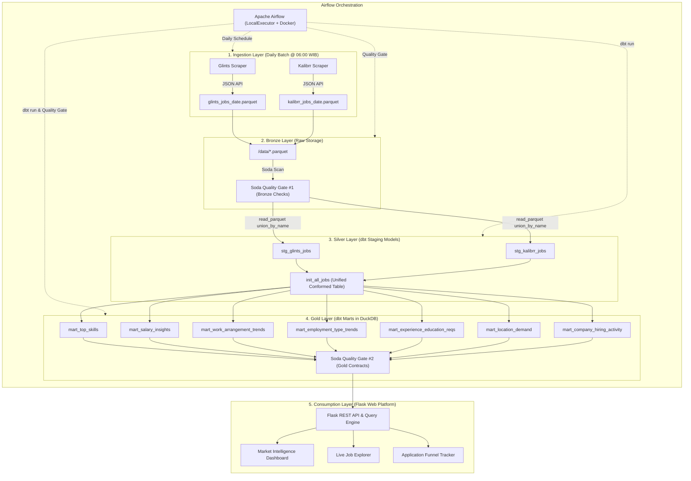

# KarirLake: End-to-End Modern Analytical Lakehouse for Indonesia Tech Job Market

[](https://airflow.apache.org/)
[](https://www.getdbt.com/)
[](https://duckdb.org/)
[](https://www.soda.io/)
[](https://www.docker.com/)
[](https://www.python.org/)
[](https://flask.palletsprojects.com/)
An automated **Medallion Data Lakehouse** pipeline and analytical intelligence platform that extracts, standardizes, validates, and visualizes fragmented tech job postings and salary compensation benchmarks across Indonesian job portals (currently supporting Glints and Kalibrr, with more portals coming soon).

---

## Executive Summary & Problem Statement

Job hunters, engineers, and tech recruiters in Indonesia face major industry pain points:
1. **Fragmented Data & Inconsistent Taxonomy**: Job portals categorize roles, working arrangements (*Onsite / Hybrid / Remote*), and employment types (*Full-time, Contract, Internship*) using conflicting schemas and terminology.
2. **Opaque Compensation**: Salaries are either undisclosed, formatted differently (e.g. annual vs monthly, string ranges), or lack standardization per city.
3. **Siloed Tracking**: Candidates apply across multiple portals and lose track of their interview pipeline, lacking clear metrics on their application-to-interview conversion rate.

**KarirLake** solves this by implementing an end-to-end data platform:
* **Automated Extraction**: Daily scheduled scraping pipelines orchestrated by Apache Airflow.
* **Data Contracts & Governance**: Automated Soda Core scans validating data integrity before and after modeling.
* **Medallion Modeling**: dbt models transforming multi-source Bronze Parquet files into clean Silver views and Gold analytical marts stored in DuckDB.
* **Interactive Intelligence**: A responsive web application offering market salary benchmarks, top skill demand rankings, fuzzy search, and a personal recruitment funnel tracker with Sankey conversion diagrams.

---

## End-to-End Architecture



---

## Tech Stack & Engineering Choices

| Layer | Tool / Technology | Why It Was Chosen |
| :--- | :--- | :--- |
| **Orchestration** | **Apache Airflow 2.8+** | Industry-standard workflow orchestrator; manages task dependencies, automatic retries, and scheduled DAG execution in Asia/Jakarta timezone. |
| **Storage & OLAP** | **DuckDB & Apache Parquet** | Serverless, lightning-fast columnar analytical database. Capable of processing analytical SQL aggregations over millions of records in sub-milliseconds without cloud data warehouse costs. |
| **Transformation** | **dbt (data build tool)** | Implements software engineering best practices for data transformations (modularity, version control, DRY principles, automated documentation, and tests). |
| **Data Quality** | **Soda Core** | Declarative data contract testing to catch data anomalies (negative salaries, null primary keys, duplicate records) before ingestion into downstream marts. |
| **Containerization** | **Docker & Docker Compose** | Reproducible development and deployment environment isolating Airflow Webserver, Scheduler, and PostgreSQL metadata DB. |
| **Backend & Search** | **Python Flask & RapidFuzz** | Lightweight, high-throughput REST API serving analytical aggregations and sub-millisecond multi-field fuzzy string matching. |
| **Frontend & UI** | **Vanilla CSS & Chart.js** | Tailored Linear/Framer-inspired dark/light theme tokens, responsive layouts, dynamic interactive charts, and Sankey conversion funnel visualizations. |

---

## Data Modeling & Medallion Architecture

The transformation layer conforms to the **Medallion Lakehouse Architecture**:

### 1. Bronze Layer (Raw Storage)
- **Path**: `data/*.parquet`
- Ingested daily as raw Parquet files directly from portal REST APIs.
- Captures point-in-time snapshots with columns: `id`, `job_title`, `company_name`, `work_arrangement`, `employment_type`, `salary_min`, `salary_max`, `education_level`, `min_experience`, `skills`, `posted_at`.

### 2. Silver Layer (Conformed & Standardized Models)
- **`stg_glints_jobs` & `stg_kalibrr_jobs`**:
  - Implements **Schema Evolution** handling using DuckDB's `read_parquet('...', union_by_name=true)` to seamlessly handle backward compatibility across legacy and newly added schema columns.
  - Standardizes **Work Arrangements** into uniform values: `'Onsite'`, `'Hybrid'`, `'Remote'`.
  - Standardizes **Employment Types** into: `'Full-time'`, `'Contractual'`, `'Internship'`, `'Part-time'`, `'Freelance'`.
  - Standardizes **Minimum Experience** into integer years (resolving portal-specific quirks such as Kalibrr's `work_experience >= 100 // 100` encoding).
- **`init_all_jobs`**:
  - Pure `UNION ALL` conformed dataset combining both platforms with identical schema definitions and deduplication metadata.

### 3. Gold Layer (Dimensional Analytical Marts)
- **`mart_top_skills`**: Aggregated skill frequency and industry demand ranking per technical job category.
- **`mart_salary_insights`**: Min, average mid, and max compensation benchmarks segmented by role and city.
- **`mart_work_arrangement_trends`**: Time-series proportion of WFH/Remote, Hybrid, and Onsite job availability.
- **`mart_employment_type_trends`**: Proportion of permanent roles vs contractual and internship opportunities.
- **`mart_experience_education_reqs`**: Correlation matrix between degree requirements (*High School, Diploma, Bachelor, Master*) and experience levels.
- **`mart_location_demand`**: Geographic concentration of hiring hubs across Indonesian provinces.
- **`mart_company_hiring_activity`**: Employer hiring leaderboard identifying companies with the highest active hiring volume.

---

## Data Quality & Contracts (Soda Core)

Automated quality gates are enforced at both the ingestion boundary and reporting layer:

### Bronze Quality Gate (`checks_bronze.yml`)
```yaml
checks for bronze_glints:
  - row_count > 0:
      name: "Ensure bronze glints parquet is not empty"
  - missing_count(job_id) = 0:
      name: "Job ID must never be null"
  - duplicate_count(job_id) = 0:
      name: "Job ID must be strictly unique"
  - missing_count(job_title) = 0:
      name: "Job title is mandatory"
```

### Gold Quality Gate (`checks_gold.yml`)
```yaml
checks for init_all_jobs:
  - duplicate_count(job_id, source_platform) = 0:
      name: "Duplicate composite key check"
  - invalid_count(standard_role) = 0:
      valid values: ['Data Engineer', 'Data Analyst', 'Data Scientist', 'Database Administrator', 'Data Architect']
  - invalid_count(work_arrangement) = 0:
      valid values: ['Remote', 'Hybrid', 'Onsite']
  - invalid_count(education_level) = 0:
      valid values: ['High School', 'Diploma', 'Bachelor', 'Master', 'Doctorate', 'Not Specified']

checks for mart_salary_insights:
  - min(avg_salary_min) >= 0
  - min(avg_salary_max) >= 0

checks for mart_top_skills:
  - missing_count(skill_name) = 0
  - min(total_demand) > 0
```

> **Validation Status**: `8/8 Bronze Checks PASSED` | `9/9 Gold Checks PASSED`

---

## Web Intelligence Platform Features

The consumption layer ([KarirLake Web Platform](file:///home/imam/project/analytic-lakehouse/web)) brings the Lakehouse data to life:

1. **Analytical Executive Dashboard**:
   - High-level KPIs: Total Verified Jobs, Average Market Salary (IDR), Remote Ratio Index, Active Employers.
   - Dynamic interactive charts: *Top In-Demand Skills*, *Salary by Location*, *Work Arrangement Spread*, *Employment Type Distribution*, and *Experience Seniority Tiers*.
   - Reactive Role Filter Pills (*Data Engineer, Data Analyst, Software Engineer, Data Scientist, ML Engineer*) that update all charts and metrics asynchronously via REST APIs.

2. **Live Job Explorer**:
   - Sub-millisecond Fuzzy Keyword Search powered by Levenshtein distance matching across position, skills, company, and location.
   - Multi-parameter filter toolbar: Role, Platform, Work Arrangement (*Onsite / Hybrid / Remote*), Contract Type (*Full-time, Contract, Internship*), and Experience Tier (*Entry, Junior, Mid, Senior, Lead*).
   - Multi-column sortable table with dynamic pagination and detailed job modals.

3. **Personal Recruitment Funnel Tracker**:
   - 1-Click Bookmark to save jobs from any portal into an active recruitment pipeline.
   - Kanban-style pipeline tracking: `Saved` $\rightarrow$ `Applied` $\rightarrow$ `Interviewing` $\rightarrow$ `Offered` / `Rejected`.
   - **Interactive Sankey Diagram** visualizing end-to-end recruitment funnel conversion and drop-off rates.

---

## Quickstart: Running Locally

### Prerequisites
- [Docker & Docker Compose](https://docs.docker.com/get-docker/) installed
- Python 3.10+ (for local web server testing)

### 1. Clone the Repository
```bash
git clone https://github.com/your-username/analytic-lakehouse.git
cd analytic-lakehouse
```

### 2. Launch the Orchestration & Lakehouse Environment
```bash
# Start Airflow Webserver, Scheduler, and PostgreSQL Metastore
docker compose up -d
```
- Airflow Web UI: `http://localhost:8080` (Username: `airflow` | Password: `airflow`)
- Scheduled Timezone: `Asia/Jakarta (WIB)`

### 3. Run Transformations & Quality Checks
```bash
# Execute dbt transformation models into DuckDB
docker exec analytic-lakehouse-airflow-scheduler-1 bash -c "cd /opt/airflow/dbt_lakehouse && dbt run"

# Run Soda Data Quality Scans
docker exec analytic-lakehouse-airflow-scheduler-1 bash -c "cd /opt/airflow && soda scan -d lakehouse -c soda/configuration.yml soda/checks_gold.yml"
```

### 4. Run the Web Application
```bash
# Install web dependencies
pip install -r requirements.txt

# Start the Flask web application
python web/run.py
```
- Access Web App: `http://localhost:5050`

---

## Repository Structure

```text
analytic-lakehouse/
├── airflow/
│   ├── dags/
│   │   └── lakehouse_dags.py        # Scheduled DAG pipeline definition (Airflow)
│   └── logs/                        # Task execution logs
├── dbt_lakehouse/                   # dbt Project root
│   ├── models/
│   │   ├── sources.yml              # Source declarations with union_by_name config
│   │   ├── staging/                 # Silver layer: stg_glints_jobs, stg_kalibrr_jobs
│   │   └── marts/                   # Gold layer: init_all_jobs & analytical marts
│   ├── dbt_project.yml              # dbt configurations & DuckDB connection
│   └── profiles.yml                 # Target database configuration
├── soda/
│   ├── configuration.yml            # DuckDB datasource connection for Soda
│   ├── checks_bronze.yml            # Ingestion data quality contracts
│   └── checks_gold.yml              # Mart data governance contracts
├── scripts/
│   └── scrapers/
│       ├── base.py                  # Abstract base scraper with polite rate limiting
│       ├── glints.py                # Glints API extractor & schema mapper
│       └── kalibrr.py               # Kalibrr API extractor & schema mapper
├── web/                             # Analytical Web Application
│   ├── run.py                       # Application runner
│   └── app/
│       ├── database.py              # DuckDB OLAP analytical query interface
│       ├── app_db.py                # SQLite transactional user & tracker storage
│       ├── routes/                  # REST API & View blueprints
│       ├── static/                  # CSS (Design tokens) & JS (Chart.js, Sankey)
│       └── templates/               # Jinja2 HTML templates (Dashboard, Explorer, Tracker)
├── data/                            # Raw Bronze Parquet files
├── lakehouse.duckdb                 # Embedded analytical database file
├── docker-compose.yml               # Multi-container orchestration definition
├── Dockerfile                       # Airflow custom image with dbt, soda & scrapers
└── README.md                        # Documentation
```

---

## Author & Engineering Contact

Built by **Imam** (Data Engineer).  
Connect on [LinkedIn](https://linkedin.com) or explore more projects on [GitHub](https://github.com).
